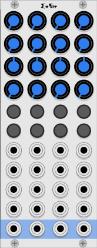

# ExFor four channel mixer expander

ExFor is used to add four more channels to the Form "master mixer". ExFor is only functional when it is placed directly to the left of a Form mixer, or another ExFor that is paired with a Form. As many ExFor expanders may be added to the left as you like. So, for example, you could make a 32 channel mixer with one Form and seven ExFors.

The ExFor and the Form recognize each other, and automatically connect together the stereo master bus, the two stereo aux busses, and the solo bus.  This allows all the linked mixers to act as one without any extra cables.

The ExFor is of course just four channel strips from the Form mixer. Refer to the [Form instruction manual](./form.md) for detailed instructions.

Note that the settings in the context menu only apply to one section, so you may set those options differently for each group of four channels.
