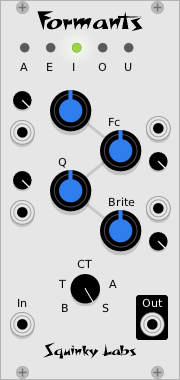

# Formants vocal filter 

Like the **Vocal Animator**, this is a filter bank tuned to the formant frequencies of typical **singing voices**. Unlike Growler, however, the filters do not animate on their own. In addition, the filters are preset to frequencies, bandwidths, and gains that are taken from **measurements of human singers**.

One of the easiest ways to **get a good sound** from Formants is to use it like a regular VCF. For example, control Fc with an ADSR. Then put a second modulation source into the vowel CV - something as simple as a slow LFO will add interest.

Use it as a **filter bank**. Just set the knobs for a good sound and leave it fixed to add vocal tones to a pad. Again, modulating the vowel CV can easily give great results.

Try to synthesize something like **singing** by sequencing the vowel CV of several formants. Leave the Fc in place, or move it slightly as the input pitches move.

Controls:

* **Fc** control moves all the filters up and down by the standard one "volt" per octave.
* **Vowel** control smoothly interpolates between 'a', 'e', 'i', 'o', and 'u'.
* **Model** control selects different vocal models: bass, tenor, countertenor, alto, and soprano.
* **Brightness** control gradually boosts the level of the higher formants. When it is all the way down, the filter gains are set by the singing models in the module, which typically fall off with increasing frequency. As this control is increased the gain of the high formant filters is brought up to match the F1 formant filter.

The **LEDs across the top** indicate which formant is currently being "sung".
