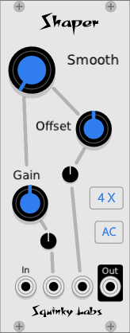
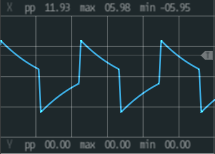
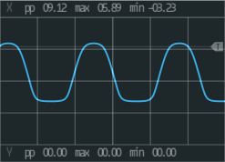
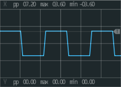
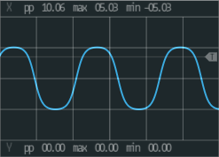
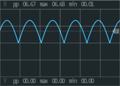
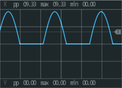
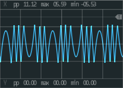
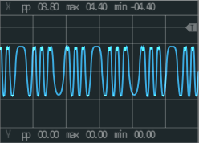
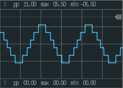

# Shaper precision waveshaper

## About Shaper
Shaper is a waveshaper offering many different shape options. Some of these shapes are commonly found in other wave shapers, and some are unique to Shaper. It can be used to modify the waveforms from a VCO, or to add distortion to some other sound. And, as usual, the creative user may use it to process control voltages, or other "left field" uses.

A unique feature of Shaper is that it has very little aliasing, whereas most we have seen have a lot of aliasing. The other special thing about Shaper is that it has a few shapes that are good for "soft overdrive".

Shaper also has high-pass filters on the outputs, to prevent accumulation of DC. Asymmetric wave-shapes frequently contain DC, which should be removed. The filters in Shaper are four-pole butterworth filters at 20 Hz.

Although there are many creative ways to use a wave shaper, the two most common are as a mangled waveform shaper, and as a distortion/overdrive effect.

In the first use case, the waveshaper is often connected directly to the output of a VCO. This gives a large number of different sounds from the VCO. In this use, typically extreme settings are used, with folding being a classic example.

In the second use case, as a distortion/overdrive effect, often less extreme settings are used. For example, it would be unusual to run a recording of singing through a wavefolder, but a gentle overdrive is pretty common.

The switch with the labels 16X, 4X, and 1X controls the amount of oversampling. This is how Shaper keeps aliasing under control. Waveshapers by their nature generate a lot of harmonics at high frequencies, and these tend to “fold back” into the audio range as aliasing. Oversampling reduces this effect by doing all the processing at a higher sample rate, then removing the frequencies that are too high, and reducing the sample rate back down. The more oversampling, the less aliasing.

At 16X, Shaper is oversampling by a factor of 16. So for a 44,100 sampling rate, Shaper would be working at 705kHz! This is the oversampling rate used by Fundamental VCO-1 and Functional VCO-1. At this setting it is very difficult to hear or measure any aliasing at all, although it is present in tiny amounts.

In general we recommend 16X, but there are several reasons you might want to set it lower. Firstly, you may actually want aliasing. When using Shaper as an extreme mangler the extra grit and digital nasties may fit perfectly. The other reason is CPU usage. Although Shaper at X16 does not use a large amount of CPU, it uses a lot less at 4X or 1X. It’s pretty much proportional to the setting. At 16X Shaper does 16 times as much work as at 1X.

If you are using one of the gentler settings of Shaper, 4X may have completely inaudible alisasing also. With some settings, however, we can measure significant aliasing at 4X. If you have plenty of CPU, just leave it at 16X or 1X. But if you are running out of CPU 4X can be a very workable and smooth sounding alternative.

Aside from the Oversampling selector, there are three controls:

*Gain* – boosts the input signal, which tends to cause more shaping, distorting, and mangling. Controlled by the gain knob, and the gain CV. There is an attenuator on the gain CV.

*Offset* – shifts the signal before it hits the waveshaper. In general that will increase the level of even harmonics in the output. Many of the shapes will output no even harmonics at all if the offset is zero. Like the gain, the offset is controlled by a knob, and a CV with attenuator.
The offset is bidirectional, so there is no offset when the knob is straight up and the CV is zero.

*Shape* – this is the big unlabeled button. It selects from the different shapes that Shaper can produce. The name of the selected shape is to the right of the knob.

## Some notes on the different shapes

**Update**: Since we added dc-blocking high pass filters to Shaper, the outputs will not look exactly like the images below. For example, the hard clipper now looks like this:

### Smooth

Smooth is inspired by the asymmetrical distortion curve of a vacuum tube triode. It is by no means a model of a tube at all, but the shape is similar.
Smooth uses gentle curves, and wants to be used more as a distortion or thickener  that a full on mangler.

With the Smooth setting, the offset control doesn’t actually control the offset; it controls the amount of asymmetry in the output. So, like a normal offset it will bring in even harmonics, but the way the even harmonics come in at different levels is unique.

Where normally there are the least even harmonics when the knob is in the middle, with Smooth there are no even harmonics when it’s all the way down.

### Clip

Classic hard clipping. With the gain high the output will be a square wave.
Clip is not very useful for shaping a VCO output, since most VCOs already put out a square wave. But it is useful for generating a lot of distortion. It is similar to some guitar fuzz-boxes.

### Emitter Coupled

Models the saturation of an emitter coupled pair amplifier input, as was commonly found in the classic 3080 “OTA” chip that was used in many analog synthesizers and some phase shifters. Even when driven hard, Emitter Coupled will not distort as much as some of the other shapes, and definitely won’t mangle a sound.

### Full Wave

A very simple shape, but one that has some unique characteristics. This is just the absolute value function we learned about in school. Its unique characteristic is that while it generates a lot of distortion harmonics, it does not compress the dynamic range of music played through it.

It is called Full Wave because this is an idealized version of the shape that will come out of a full wave rectifier circuit.

While the full wave shape is usually too harsh and "buzzy" to use as an overdrive/distortion, it does make a nice mangler.

### Half  Wave

Has much in common with the full wave shape, but its radical asymmetry guarantees that a lot of even harmonics will be in the output.

Unlike most of the shapes, both of the rectifier shapes have the same harmonic content regardless of the gain setting. So here it only functions as a volume control.

### Fold

The "wavefolder" is a legendary and classic synthesizer module. Both Buchla and Serge offer wavefolder modules, and they were (and remain) very popular. The wavefolder we have implemented in Shaper is not an attempt at an emulation of those classics, but is a mathematically simple folding of the input.

One thing all wavefolders have in common is that the sound changes quite a bit as the gain increases, sounding something like a filter sweep, or even more like the sweep of a synched VCO. So one of the first things to try is modulating the gain input with an envelope or other modulation source.

One thing our wavefolder has in common with the analog classics is that it has little or no aliasing. Wavefolding generates a huge amount of high harmonics, so a digital implementation that does not deal with the aliasing is going to sound different from Shaper (or an analog module).

That said, musicians can undoubtedly find uses for the fully aliased version. We encourage you to try at 16X and at 1X.

### Fold 2

Whereas “Fold” is a standard wavefolder, Fold2 is a little bit different. It is asymmetric no matter what offset is fed into it. It also generates more high harmonics than any other shape.

### Crush

Crush simulates bit reduction by using a continuous voltage quantizer. As the gain is turned up it will pass 16 bits, down to 8 bits, and finally one bit.

## More Info

We have an informational article that talks more about aliasing. It goes into some specifics about Shaper, but also has some useful general information.

[Aliasing Story](./aliasing.md).