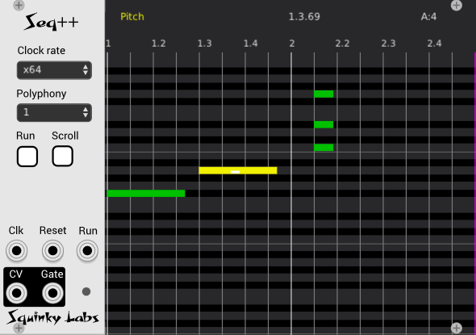

# Seq++ Polyphonic piano-roll sequencer

If you read nothing else, please checkout out the list of keyboard "shortcuts", and the mouse commands. This is the only way you can hope to figure out how to enter notes quickly: Keyboard mappings [here](./keymap.md) Mouse:[here](./mouse.md).

That said, the entire manual is not very long, and there is quite a bit of useful information in here. If you don't read it now, consider coming back later.

## About this Sequencer

This sequencer is a hybrid of a modern DAW's MIDI editor, and the MS-DOS sequencer "Sequencer Plug Gold" originally released in 1984. Sequencer Plus was the first popular sequencer to feature a "piano roll" note editor.

So, while Seq++ is much like a typical DAW's MIDI edit screen, it is not exactly like those. You many enter notes with a mouse, as you would expect, but there is also an extensive keyboard interface. Because of this hybrid identity, there are two cursors: the mouse cursor and the blinking keyboard cursor.

The note editor is heavily focused around the keyboard interface, which allows the user to "type in" music very quickly. More conventional note-entry is available with the mouse.

It can deal with tracks that are arbitrarily long and dense. User may edit the notes as the sequencer is playing with no bad effects.

There are some concessions to the current world - it has unlimited undo/redo, and clipboard support.

There is no limit to how long the sequence can be, although initially it may not be obvious how to extend it.

A two bar range may be looped. Of course you may edit the two bar range as it loops.

## More about undo/redo

Seq++ integrates fully with VCV Rack's undo/redo system. Try inserting a note, then open the edit menu. It will say `undo Seq++: insert note`. After an undo, re-do will be available.

Like all VCV Rack undo/redo, there is no limit to the number of operations that can be un-done.

## More about the clipboard

If you cut or copy a range of notes, you may insert your cursor in a new location, and paste there. You can even go do a second instance of Seq++ and paste into that.

## About clocking and playback

Always keep the following in mind:

* The Clock Rate control only controls playback.
* The "grid" is merely a graphic overlay drawn on top of the edit window. It has no effect on playback ever.
* If "snap to grid" is enabled, some note editing operations will quantize to the grid, but it will still have no effect at all at playback time.

At the moment, there is a choice of internal clock or external. In most every case you will want to use an external clock. *Clocked* from Impromptu Modular is a good choice. Connect the clock, run and reset between Seq++ and Clocked.

Set Seq++'s clock rate to match the *Ratio* in clocked. So if Clocked is set for X4, set Seq++ to *x4 1/16".

For DAW workflows, or other times when you want fine timing, use as fine a clock resolution as possible (Clocked X 64). To intentionally coarsely quantize Seq++, use a less fine clock.

When Seq++ quantizes during playback, it should quantize "correctly" - i.e. it should quantize to the **nearest** clock. Both the start time and duration will be quantized.

If two notes of the same pitch "touch" each other, such that the end of one note is at the same time as the start of the next, Seq++ will re-trigger the note by bringing the gate low for a millisecond. Note that with quantization it is very common for two notes to touch this way.

If the sequence is set for monophonic, then is should play a proper legato if the notes fully overlap (the second one starts after the first one ends). But remember that quantization may erase this overlap, causing the re-trigger to kick in.

If there are more simultaneous notes being played than may be accommodated by the polyphony setting, then voices will get "stolen" and re-assigned to play the new notes. At the moment it uses a variation on "last note" assignment. If there is already a voice playing the new pitch, that voice will be stolen. Then any currently idle voice will be used, then the first voice will be used. This will be made more sophisticated in the future.

## Grid settings

In the edit grid, right click will bring up an context menu. This has edit grid settings: snap to grid on/off and grid spacing. The grid only affects editing, and does not affect playback.

The lines one the note grid will reflect the setting, although if won't go below 1/8th note spacing, as that makes grid lines too close and it looks ugly.

If snap to grid is enabled, the following edit operations will be quantized to the grid: drag start time, drag duration, double click to insert note, and insert note from the keyboard. In the future perhaps other operations will be quantized.

In the above operations, the start time is always quantized. Usually the duration is also quantized, but not in the case of inserting preset notes (ctrl-q, e, s, t).

## Keyboard focus

As mentioned before, the UI is heavily keyboard driven. The module will only respond the the keyboard if the cursor is over the note editor, in which case it will grab the focus as you type. Once the module had focus it keeps it until you click outside.

If you don't have the keyboard focus, some of VCV Rack's keyboard handling may kick in and delete you module (backspace) of pan the rack (cursor keys), so don't be too surprised if this happens. Because it's easy to forget, the edit grid had a conspicuous indicator that tells when it has keyboard focus.

## Basic mouse editing

Most things may be edited with the mouse as well as the keyboard. It is very easy to insert notes, delete them, drag them around, etc... It is also easy to select a group of notes and drag-edit them all at once.

## The panel side

On the left are a few inputs, outputs, and controls.

**Clock Rate** dropdown determines the clocking. Most of the settings tell the sequencer how to interpret the external clock input. Of course when it's set to internal it's a different story.

**Polyphony** dropdown selects how many voices will be played back

**Tempo** determines the tempo when the Clock Rate is set to internal.

**Run/Stop** button that changes color to  indicate when it's running. The run state is controlled from this button, as well as the external run input. Either of them can start and stop the sequencer. This button is modeled on the run button in "Clocked", from Impromptu Modular.

**Scroll mode** button enabled scrolling while running.

**CV** is the pitch CV output. It will be polyphonic if Seq++ is set for more than one voice.

**G** is the gate output. When it is active the green LED lights. It will be polyphonic if Seq++ is set for more than one voice.

**Clk** is the eternal clock input.

**Rst** is the reset CV. It is quite compatible with the reset out of "Clocked".

**Run** CV input. Meant to be hooked up to the Run output of Clocked, or similar master clock.

## Piano roll

It works like you would expect.

Note that there is a blinking "DOS cursor". It does not follow the mouse cursor much of the time. Note editing may done via the keyboard and this cursor, or with the mouse. A very powerful feature is the ability to select more than one note, and apply edits to all of them at once.

The computer keyboard is the fastest way to ender notes. Details are in [Keyboard Summary](./keymap.md).

Conventional editing with a mouse is also fully supported. Details are in [Mouse Summary](./mouse.md).

## Extending the length

The end of the sequence (loop point) is indicated with a vertical purple line in the piano roll.

There are two ways to change the length of the sequence: inserting notes past the end, and the change length command.

You may move the cursor past the end of the track. If you insert a note there, the track will be extended in units of 4/4 bars to accommodate the new note. This way there is always room available in a measure to insert new notes.

The other way, with the change length command, allows more control. Pressing the 'n' key will set the length to the nearest grid point to the cursor. This allows setting and end point that is not on a bar boundary, and also allows shortening a track.

Note that the end point is quantized to the grid, even if *snap to grid* is not enabled.

Note, also that if the end point is set earlier than any notes, the notes after the new end point will be deleted or shortened to fit in the new length.

## Some hints with editing

Once you have selected a note, or group of notes, it is very easy to move them around, typically by Pressing 's', 'd', or 'p' to set the editor editing start time, duration, or pitch. Then all selected notes may be adjusted with the '+' and '-' keys (and many others).

New notes are inserted by moving the cursor to the desired location, and pressing 'Ins'. There are many other keys for inserting different lengths of notes.

Note selection, insertion, and changing can all be done with the mouse or the keyboard. So it may be handy to select some notes with the mouse, then move them from the keyboard. Or vice versa.

You are free to perform any edit operation while Seq++ is playing. It will not glitch or crash. One tip, however: it is very difficult to edit while playing if the scroll function is enabled - you will end up fighting over the cursor position, and Seq++ will usually win. So turn off scroll if you wish to edit while playing.
