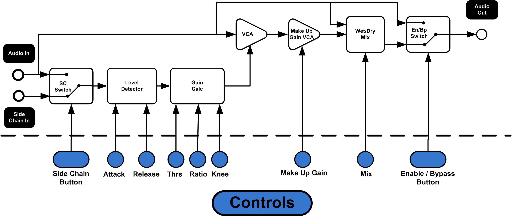

# Using a compressor

There are many ways to use a compressor, and many of them are fairly subtle. There are many sources of information about how to use compressors, so we will just try to hit some of the basics.
There are a few common uses for compressors, and these are:

* Taming an occasional peak that is too loud.
* Pulling up the ambient part of a sound.
* Generally reducing the dynamic range to make instruments sit better together.
* Special effects – notably “pumping.
* Ducking.

In general, a compressor will reduce the level of the “loud” parts. Of course this is the same as increasing the level of the soft parts, especially if you use some “makeup-gain”. Very roughly, the attack and release controls affect how quickly the compressor adapts to loud and soft parts. The threshold, and compression curve will determine “how much” the signal gets compressed.

It is very common to adjust the controls on the compressor, and end up with a sound that is “worse” than what you started with. That’s one of the reasons there is a bypass (or on/off) on our compressors. It’s always a good idea to compare the processed sound vs the original.

## Attack and Release

The attack control sets the time it takes for the compressor to reduce the gain in response to a loud sound. The release control sets how quickly the compressor will “back off” after a loud sound. You might think you want to always set these as fast as possible, but usually you don’t.

If the attack control is set very fast, it will flatten any initial transients. This can make percussive instruments like drums or bass sound anemic, as all of the leading snap is flattened out. Yet, make the attack to slow, and it won’t be able to help lower these peaks at all.

Similarly, if the release is too fast it will pull up the tails of sounds too quickly, making them sound lifeless and artificial. But set the release too long and the compressor will never “recover”, and will always just keep the volume low.

On top of this, setting the release really fast, especially when the attack is really fast, will add a significant amount of IM distortion. This is the nature of the beast, and analog compressors do it to. It will be much more severe on low pitches.

So, setting the attack and release requires experimentation.

## Threshold and Ratio

The threshold is the input level that will cause the compressor to start compressing. The ratio is how much is will compress, once it starts to compress. This is only strictly true with the “hard knee” versions of the ratio curves. “soft knee” makes this be almost true, but not completely.

So, with a hard knee, no compression at all will take place as long as the input level is below the threshold. Once the input is over the threshold, it will compress using the ratio you have selected. This ratio is the how much the input needs to change to change the output by one decibel. So, for a 4:1 compression ratio, each 4 dB increase above the threshold will cause the output to only change by 1 dB.

Soft knee is similar. Squinky Labs compressors use a 12 dB “knee width”, which is similar to what the original DBX “over easy” compressors use. With a 12dB knee, the compressor will begin to compress at about 6 dB below the threshold, and won’t fully compress until 6 dB above the threshold. In between it will smoothly go from no compression to full compression.
The soft knee sounds a little more “natural”, and a little less obvious than the hard knee. But the difference is somewhat subtle.

## Different approaches to subtle compression

Often you want to compress an instrument, group of instruments, or an entire mix without the compression being obvious. Different people favor different approaches, but no matter the approach, people tend to agree that 6 decibels and up of compression is pretty much. A couple of dB is very subtle.

But even if you only want to shave off a few dB, there are (at least) two very different ways to do this. One is to use a pretty high compression ratio, like 8:1, but keep the threshold pretty high, bringing it down such that only the loudest peaks are compressed. The other approach is to user a very low ratio, like 2:1, but use a much lower threshold. You will still get the same “several dB” of overall compression, but with this approach everything gets a touch of compression, not just the loudest peaks.

## Pumping

Pumping is sometimes an unintended consequence of poor compressor settings, or it is an intentional effect. Pumping is when, for example, a loud sound, like a drum, will play on some beats, forcing the compressor to attack and pull the volume of all the instruments way back. Then the volume rises as the release of the compressor comes in, bringing the volume back up quite noticeably in between the loud beats. This “pumping” sound can enhance the rhythm of your music, but to do so requires careful adjustment. The release time needs to be a length such that the “pump” sounds like it’s coming back on the desired beat.

## Ducking

Ducking is when you have one instrument lower the volume of another instrument automatically. The classic example is a radio station DJ. When they talk, their voice will automatically “duck” the volume of the music or ad that they are talking over. This effect is quite easy with any compressor that has a side-chain input. In the DJ example, the compressor gets its audio input from the main input, but the DJ voice is patched into the side chain input. So when the voice is above the compression threshold it will reduce that volume of the signal run through the compressor.
